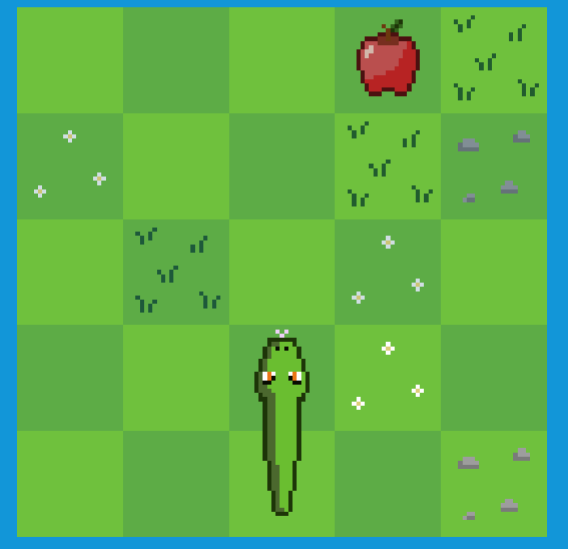

# TrianGL

**TrianGL** is a 2D game engine written in C++ and OpenGL.
It's main goal is to be as easy to use as possible, allowing developers to quickly create games without worrying about low-level tasks such as engine initialization, rendering, input handling, etc..

This is a small project that I have been working on in my free time, so it may still have missing features.
If you find any bugs or have any suggestions feel free to open an issue.



## Platform Support

Currently, **TrianGL** only supports Windows. Support for other platforms may be added in the future.

## Installation

When cloning this repository, make sure to use the `--recurse-submodules` flag to also clone the dependencies.

This engine uses premake to generate the project files.
But don't worry, you don't need to have premake installed, as its binaries are included in the repository.

To build the engine, simply run the `Build.py` script, which will generate the project files for Visual Studio 2022.
If you are using a different version of Visual Studio, you can modify the second to last line of the script to match your version.
You can also generate the project files for other IDEs by running premake manually.

```bash
git clone --recurse-submodules https://github.com/brunopj1/TrianGL.git
cd TrianGL
python Build.py
```

## Creating your game files

Once you get the engine running, you may want to create your own game inside the generated solution.
To do so, you can use the `CreateProject.py` script, which is located in the `Scripts` folder.

Before running the script, make sure to open it in a text editor of your choice and modify the configuration section at the top of the file.
Specifically, you should modify the `projectName` variable to match the name of your game, and set the `isGame` variable to `True`.

```python
# Configuration ---------------------------------------------------------------

projectName = "MyGame"

isGame = True
```

Once you have adjusted the script's configuration you can execute it, creating your project inside the `Games` folder.
If everything worked correctly, the script should output a message instructing you to add a line to the engine's `premake5.lua` file.
This line will guarantee that your game will be detected the next time you run the `Build.py` script.

```lua
group "Games"
    include "Games/Snake/premake5.lua" -- This is an existing game
    include "Games/MyGame/premake5.lua" -- Add your include here
```

Finally, you can run the `Build.py` script one last time.

## Tutorials

To learn how to use the **TrianGL** engine, make sure to check the [Wiki](https://github.com/brunopj1/TrianGL/wiki).

## Dependencies

**TrianGL** uses the following dependencies:

- [glad](https://github.com/Dav1dde/glad): A loader-generator based on the official specs for OpenGL, used for managing OpenGL function pointers.
- [glfw](https://github.com/glfw/glfw): A multi-platform library for OpenGL, used for creating the window, reading input, handling events, etc.
- [glm](https://github.com/g-truc/glm): A mathematics library for graphics software based on the OpenGL Shading Language (GLSL) specifications.
- [imgui](https://github.com/ocornut/imgui): A bloat-free graphical user interface library for C++, used for creating graphical interfaces for debugging.
- [stb_image](https://github.com/nothings/stb): A header-only library for C/C++, used for image loading.
- [soloud](https://github.com/jarikomppa/soloud): A high-level audio API, used for loading, managing and playing audio files.

All the dependencies are included in this repository as submodules.
Make sure to use the `--recurse-submodules` flag when cloning the repository in order to also clone the dependencies.

Each dependency is licensed under its own terms. Please check the respective repositories for more information.

## License

This project is licensed under the terms of the MIT license. For more details, see the [LICENSE](LICENSE.md) file.
